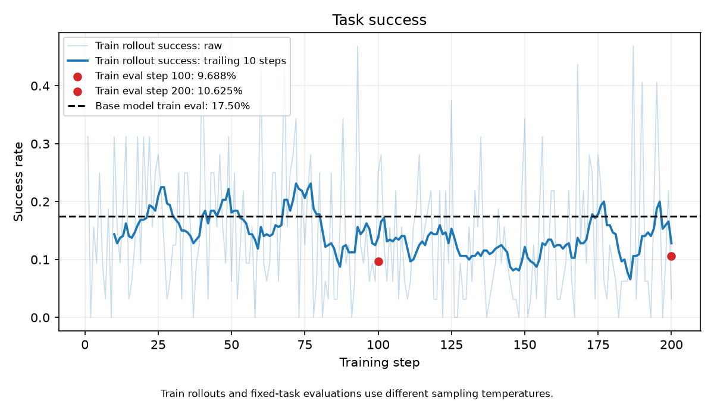
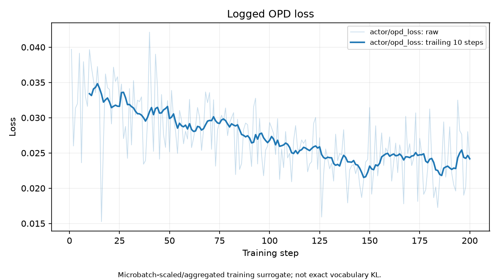
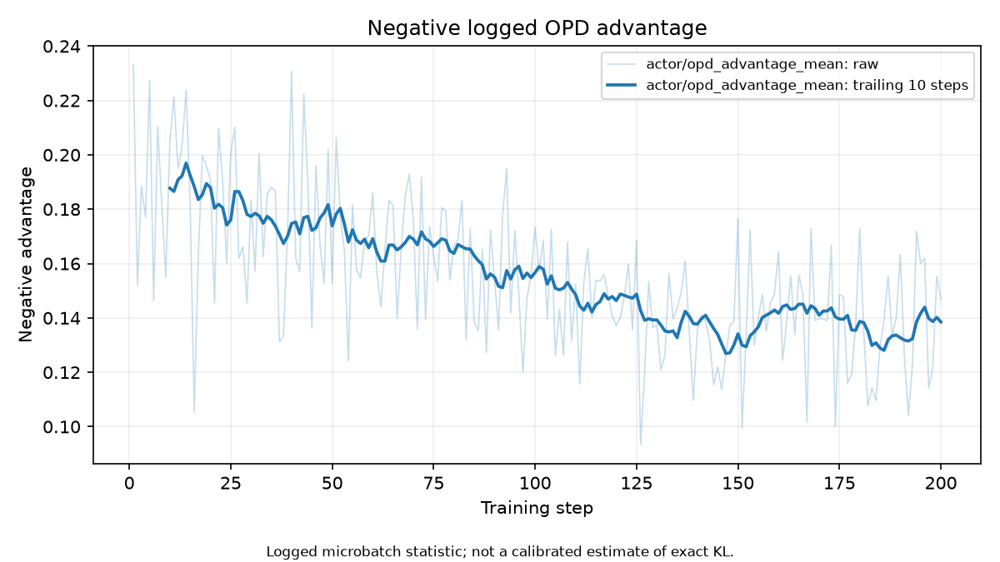
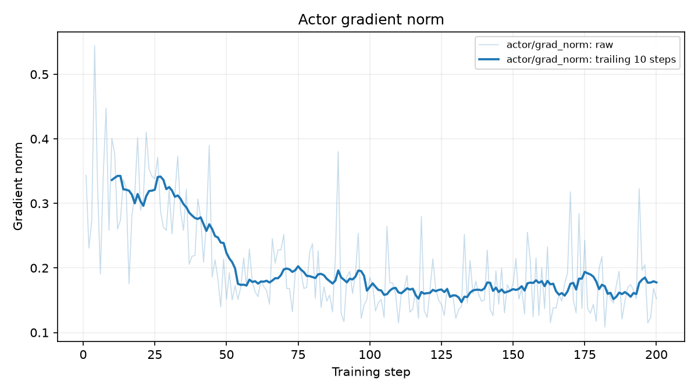
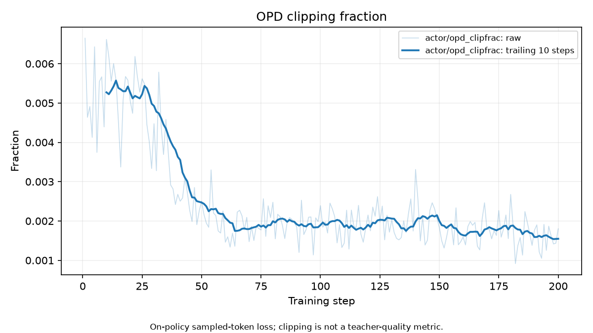
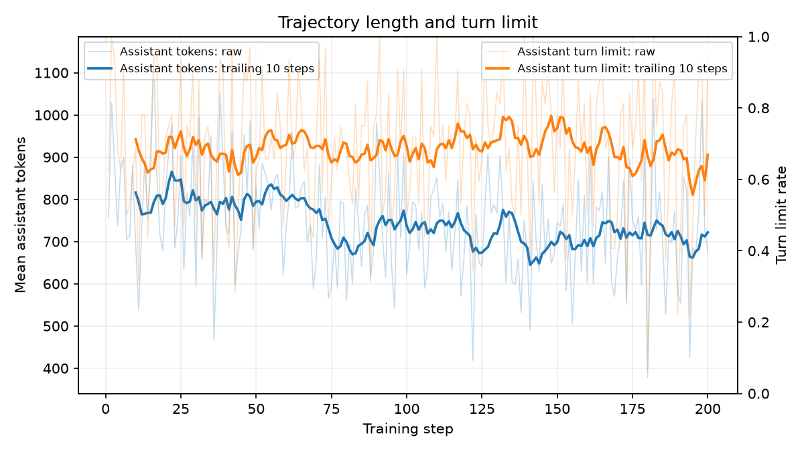

# E06 纯 OPD：200 步训练曲线与效果分析

分析日期：2026-09-26（UTC）。正式作业171290，`formal-seed42-200-v2`，冻结源码`source-gpu-v1`。

## 1. 结论与证据范围

**训练链路正常完成，但本次纯 OPD 没有改善任务成功率；最终 train 评测低于原始 Qwen3-8B。** 蒸馏日志的差值缩小、参数梯度持续存在，与任务效果改善是两件事。本次结果支持“当前配方不奏效”，尚不足以将原因归结为 OPD 算法本身、教师能力或某个实现错误。

- 作业2026-09-25 15:38:47开始，09-26 08:00:33结束，Slurm `COMPLETED/0:0`，耗时16小时21分46秒。
- `summary.json` 的 `accepted=true`，200步、6400条训练轨迹、640条周期评测轨迹、四份完整checkpoint均通过现有检查。没有非空thinking事件或API最终失败。
- step50/100/150/200完整checkpoint及adapter均归档HDD。
- 本文评测全部来自train40任务，每任务8次；独立test10任务尚未评测。没有根据test调参或挑选checkpoint。
- 原始证据：[metrics.jsonl](../experiments/e06_opd/formal-seed42-200-v2/train/metrics.jsonl)、[summary.json](../experiments/e06_opd/formal-seed42-200-v2/train/summary.json)、[分析数据及输入SHA256](../experiments/e06_opd/formal-seed42-200-v2/analysis/analysis.json)。

所有曲线以浅色显示逐步值、深色显示过去10步的移动平均。每步只抽4个任务，因此逐步成功率噪声较大；50步分段和完整40任务评测比单步尖峰更可靠。只有一个训练seed，重复尝试受任务与用户模拟器相关性影响，本文不把差异宣称为已建立统计显著性。

## 2. 核心曲线

### 2.1 任务成功率：没有持续上升

| train评测 | 成功次数 | pass¹ | pass⁴（4次全部成功） | pass@4（4次至少一次成功） |
| --- | ---: | ---: | ---: | ---: |
| E00原始Qwen3-8B，同协议 | 56/320 | 17.500% | 2.857% | 38.036% |
| E06 step100 | 31/320 | 9.688% | 1.429% | 24.286% |
| E06 step200 | 34/320 | 10.625% | 1.821% | 24.786% |

最终较E00少22次成功，pass¹下降6.875个百分点；step100到200只多3次成功，不能称为明确回升。E00有19/40个任务8次全失败，E06两个checkpoint均为26/40。逐任务比较E00与step200：6个任务成功次数增加、15个下降、19个不变。少量任务改善未弥补整体任务覆盖下降。

| 训练步区间 | 轨迹数 | rollout成功率 |
| --- | ---: | ---: |
| 1–50 | 1600 | 16.875% |
| 51–100 | 1600 | 15.375% |
| 101–150 | 1600 | 12.188% |
| 151–200 | 1600 | 13.313% |

训练曲线后半段整体低于前半段。训练temperature=1.0、top_p=1.0；评测temperature=0.7、top_p=0.9，所以训练均值与评测点不应混成同一个指标。E00与E06的固定评测口径一致。



### 2.2 OPD loss与teacher–student差值：代理目标变化未转化为收益

| 50步区间 | 记录的OPD loss | 记录的蒸馏优势均值 | 正向token比例 | 负向token比例 |
| --- | ---: | ---: | ---: | ---: |
| 1–50 | 0.03165 | -0.18032 | 9.03% | 78.85% |
| 51–100 | 0.02827 | -0.16271 | 20.95% | 68.43% |
| 101–150 | 0.02446 | -0.14121 | 21.13% | 67.38% |
| 151–200 | 0.02401 | -0.13854 | 22.37% | 66.49% |

固定采样token的信号为：

$$
A_t^D=\operatorname{stopgrad}\left[\log\pi_T(y_t\mid h_t)-\log\pi_{old}(y_t\mid h_t)\right].
$$

差值均值变得没那么负，与学生在所访问状态上接近教师的趋势相容，但不是严格的全分布KL测量。每步采样的状态也在变化，不能把曲线当作固定数据上的收敛实验。负向token较多本身并不说明符号写反或梯度错误；对学生分布采样时，理想期望下这个差值对应负的reverse KL。

**已确认的日志口径问题：** actor对每个动态微批的loss乘以该微批样本占比，梯度按这些缩放值正确累加；记录时却又对缩放后的微批loss取简单平均。因此 `actor/opd_loss` 比实际batch目标多一层微批平均，受微批数影响。优势均值、正负比例及clipfrac也是微批内token平均后再跨微批等权平均，不是全batch有效token的精确加权统计。当前没有保存逐步微批数量，不能事后精确还原真实batch loss。该问题影响读图，不能据此说反向传播也重复缩放。

代码证据：[dp_actor.py](../../verl/verl/workers/actor/dp_actor.py)、[distillation_loss.py](../../verl/verl/trainer/ppo/distillation_loss.py)、[reduce_metrics](../../verl/verl/utils/metric/utils.py)。





### 2.3 参数梯度与clipping：更新存在，没有明显数值崩溃

| 50步区间 | 参数梯度范数均值 | OPD clipfrac均值 |
| --- | ---: | ---: |
| 1–50 | 0.29284 | 0.431% |
| 51–100 | 0.18381 | 0.194% |
| 101–150 | 0.16324 | 0.196% |
| 151–200 | 0.17194 | 0.169% |

- 200步参数梯度范数均为有限非零，范围0.1083–0.5442，低于配置的梯度裁剪阈值1.0。没有梯度爆炸或长期零梯度的证据。
- 每全局步是32条轨迹、1次optimizer step。YAML中的mini-batch=4在FSDP worker初始化时乘rollout.n=8，得到32；动态微批仅负责梯度累积。
- `actor/opd_logprob_grad_norm`是对log-prob张量的导数范数，不是LoRA参数梯度；判断实际参数更新优先看`actor/grad_norm`。
- E06的`actor/pg_loss`和`actor/rl_loss`为0是纯OPD设置的预期结果，不能据此判定未训练。
- clipfrac是按优势方向触发PPO surrogate裁剪的比例。小于1%不证明actor与vLLM rollout的概率完全一致，也不直接支持增大学习率。

目前pure OPD分支跳过通用rollout correction诊断，缺少current/rollout log-prob误差、ratio分位数和实际更新前后KL。教师输入原始token IDs、mask、tokenizer与版本检查没有暴露错位，但这些协议检查无法替代跨推理后端的概率一致性验证。





### 2.4 输出长度与交互行为：文本变短，没有更快完成任务

训练第1–50步到151–200步，每条轨迹assistant token均值从802.9降到716.2，但轨迹记录的assistant轮数从12.945到13.063，未减少。`response_length/mean`包括交错的用户/工具内容，不能直接称为模型生成的token数；本节使用轨迹的assistant字段。

| 固定train评测行为 | E00 | E06 step100 | E06 step200 |
| --- | ---: | ---: | ---: |
| assistant token/轨迹 | 795.5 | 670.8 | 682.4 |
| assistant轮数/轨迹 | 12.959 | 13.084 | 12.963 |
| 以assistant轮数上限结束 | 220/320（68.75%） | 222/320（69.38%） | 214/320（66.88%） |
| 有完全相同工具名＋参数重复调用的轨迹 | 169/320（52.81%） | 208/320（65.00%） | 195/320（60.94%） |
| 工具执行返回error | 415/2550（16.27%） | 452/2411（18.75%） | 332/2346（14.15%） |

step200的286条失败轨迹中206条达到assistant轮数上限，占72.03%；但E00本身也有相近的轮数上限率，因此不能说OPD新引入了所有超时问题。训练后这种瓶颈仍未解决。

完全相同的查询可能是合法重查，不能把所有重复调用直接分类成循环错误。这个比例上升结合成功率下降，支持后续重点审查交互停滞。step200工具返回错误中，160次来自`update_reservation_flights`、96次来自`get_user_details`；工具schema合法不保证参数语义、实体ID、业务约束或操作顺序正确。工具错误率略降仍未转化成任务完成率，进一步说明格式与局部工具指标不足以替代最终成功判定。

现有`reasoning_tokens_per_turn`记录的是每轮assistant输出长度，并非只统计`<think>`内容；实际审计nonempty_thinking=0。不能把该曲线非零当成思考模式开启。



## 3. 已确认的问题与待验证原因

| 判断 | 证据与边界 |
| --- | --- |
| 已确认：本次任务效果不佳 | 两次固定评测均低于E00；训练成功率后半程较低；26/40任务全失败 |
| 已确认：目标缺少直接任务奖励 | E06 RL系数0、OPD系数1；任务成败只记录，不参与PG更新 |
| 已确认：日志不足以精确评估蒸馏收敛 | 动态微批日志聚合口径偏差；缺少ratio/更新后KL与固定探针集 |
| 已确认：交互瓶颈仍在 | 高轮数上限比例、重复工具调用、实体/业务工具返回错误；尚未逐例确证唯一根因 |
| 待验证：32B教师是否更擅长当前协议 | 尚无相同非思考、工具schema、轮数和MiMo条件下的教师任务成功率；参数规模更大不构成证据 |
| 待验证：sampled-token监督是否主要改变表达而非关键动作 | 更短输出、差值缩小与任务不升符合此假设，但目前未分普通文本/工具名/参数/终止token统计 |
| 待验证：actor与rollout概率是否有实质偏差 | 不同后端存在需测量的可能性，现有日志没有足够直接证据；不能直接宣称实现错误 |

当前采用的PG OPD与veRL官方描述的sampled-token负reverse-KL奖励方向一致。官方同时支持任务奖励组合与top-k forward-KL GKD；后者需要分布监督和直接梯度，不能只把当前PG的标量奖励替换成top-k KL便视为等价。[veRL OPD官方文档](https://verl.readthedocs.io/en/latest/algo/opd.html)。

## 4. 改进优先级

1. **先补诊断与教师基线。** 后续运行修正微批日志聚合、记录微批数量和有效token、记录current/rollout log-prob误差及ratio分布；使用同一评测入口测Qwen3-32B在当前train协议上的表现。逐例检查实体ID错误、航班改签错误与重复调用。优先train侧分析，不用test选配置。
2. **按预定最终checkpoint完成独立test评估。** 固定step200，沿用现有10×8协议。用于报告泛化结果，不用于重新选checkpoint。本文尚未执行这项GPU评测。
3. **下一训练对照优先既有E07。** E07已实现 `L_GRPO + 0.3 L_OPD`，可以检验任务奖励是否补足当前目标的不足。先确认教师与概率口径，再做短验证和正式对照；不能预先保证联合一定优于E01，也不应因为当前曲线不佳直接加长E06。
4. **若教师明显更强、E07仍无收益，再比较分布蒸馏。** 优先复用上游top-k forward-KL/GKD能力，单独记录算法变更与资源成本。不要将改变目标的新结果混作本轮纯PG OPD复现。

不建议当前直接提高学习率、增加步数、提高assistant轮数上限或按结果删除失败轨迹。这些操作没有被现有证据定位为有效修复；改变轮数还会破坏与E00/E01的直接可比性。

## 5. 复现、资源和交付

分析工具：[analyze_training_curves.py](../scripts/eval/analyze_training_curves.py)。复用现有pass指标函数，流式扫描轨迹和工具审计，不加载模型。CPU作业171786完成统计但缺matplotlib导致绘图失败；171787在独立目录安装绘图依赖后完成；171788修正图例重叠并生成最终图表。均未申请GPU，训练源码和产物未改动。

在主项目目录激活既有环境后，CPU Slurm作业内执行：

```bash
PYTHONPATH=experiments/e06_opd/formal-seed42-200-v2/analysis/plot_packages \
python scripts/eval/analyze_training_curves.py \
  --run-dir experiments/e06_opd/formal-seed42-200-v2/train \
  --output-dir experiments/e06_opd/formal-seed42-200-v2/analysis \
  --baseline-run-dir experiments/e00_qwen3_baseline/protocol-v2-ready-v1/eval
```

PNG/PDF保存在本目录的`e06_training_curves/`，完整JSON留在实验analysis目录；输入文件SHA256随JSON保存。重复工具调用统计只匹配相同工具名和JSON参数，不能替代人工语义归因。全程无模型训练或GPU评测。

正式双卡作业分配时间约32.73 GPU-hours。原summary的`gpu_hours`其实是训练入口墙钟小时，未乘2，不应用来误报双卡成本。每步均值约274秒，教师评分约58秒；效率优化属于后续问题，当前优先解决任务效果。

本次由explorer核对loss与日志含义，worker实现可复用分析脚本，主线程核验mini-batch归一化、运行CPU分析、审阅图表与结论并更新文档。
