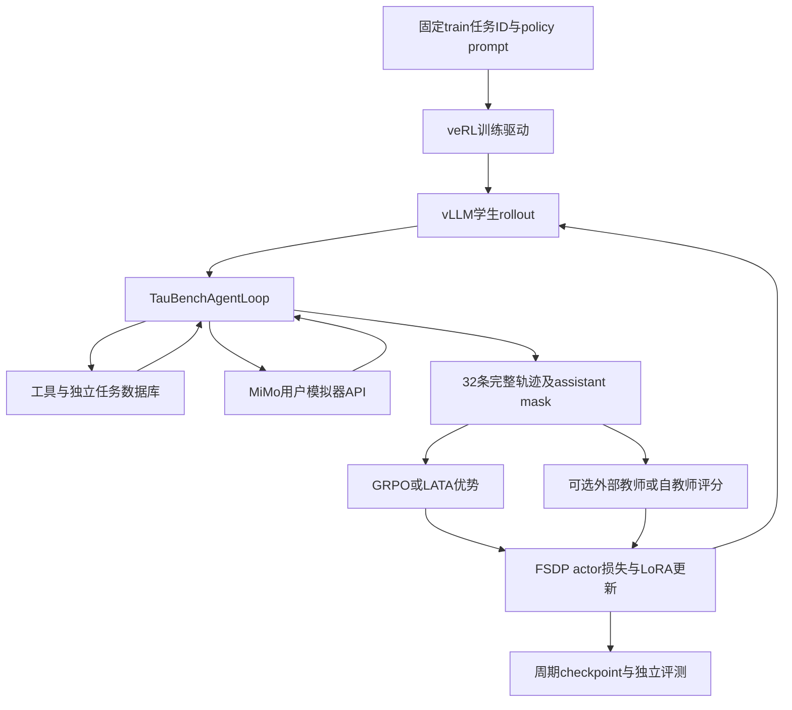
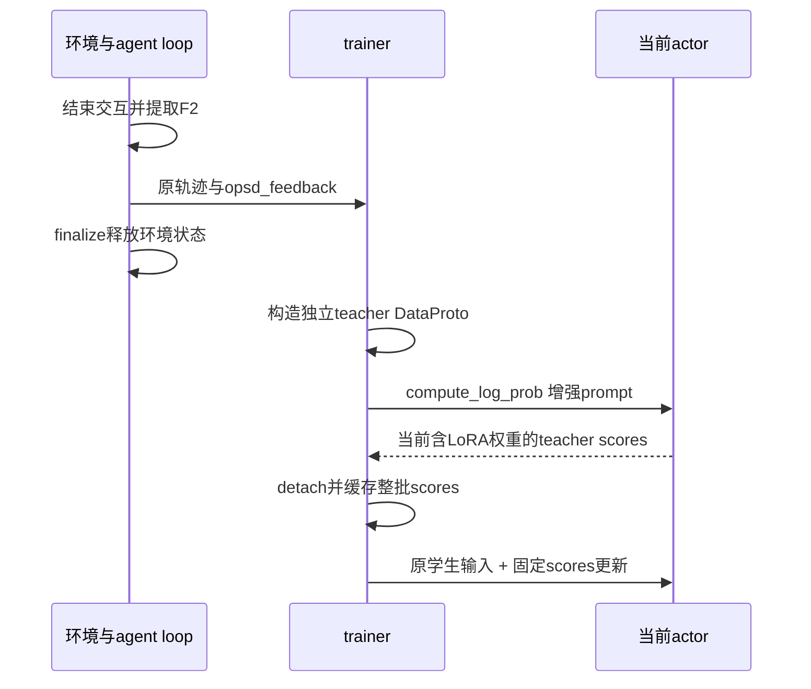

# 长程工具 Agent 实验：架构、算法与执行流程

> 文档整理日期：2026-09-23（UTC）。覆盖当前实际推进的 E00、E01、E05、E06、E07、E11、E12。实现事实以源码和运行快照为准；“已实现”“CPU通过”“GPU训练完成”“结果验收通过”分别记录。
>
> 配套阅读：[τ-bench 数据与评测说明](tau_bench_dataset_and_evaluation.md)。本文件解释实验系统与方法，配套文件解释任务、成功判定和指标。

## 目录

1. [研究问题与实验矩阵](#1-研究问题与实验矩阵)
2. [系统组件与部署架构](#2-系统组件与部署架构)
3. [统一配置与数据预算](#3-统一配置与数据预算)
4. [一轮训练的完整数据流](#4-一轮训练的完整数据流)
5. [E00与E01](#5-e00与e01)
6. [E05：GRPO＋PRM-Lite＋LATA](#6-e05grpoprm-litelata)
7. [E06与E07：外部教师OPD](#7-e06与e07外部教师opd)
8. [E11与E12：反馈条件自蒸馏](#8-e11与e12反馈条件自蒸馏)
9. [统一评测流程](#9-统一评测流程)
10. [性能、资源与存储](#10-性能资源与存储)
11. [代码与配置入口索引](#11-代码与配置入口索引)
12. [产物、日志与验收](#12-产物日志与验收)
13. [执行状态与结果快照](#13-执行状态与结果快照)
14. [复现要求和结论边界](#14-复现要求和结论边界)

## 1. 研究问题与实验矩阵

任务是让 Qwen3-8B 在 airline 工具环境中，通过多轮询问、查询和数据库操作完成用户目标。研究问题是：稀疏终局奖励、规则过程奖励、外部教师和反馈自教师分别能提供什么训练信号，以及是否改善独立任务成功率。

| 编号 | 方法 | 用于更新的信号 | 教师 | 当前实现入口 |
| --- | --- | --- | --- | --- |
| E00 | 原始 Qwen3-8B 基线 | 不训练 | 无 | `eval_qwen3.sh`，不设adapter |
| E01 | Vanilla GRPO | 二元任务结果 | 无 | `qwen3_formal.yaml` |
| E05 | GRPO＋PRM-Lite＋LATA | 结果＋规则过程分数；位置/长度优势变换 | 无 | `qwen3_prm_lite_lata.yaml` |
| E06 | 纯 OPD | sampled-token 蒸馏 PG | 冻结 Qwen3-32B | `qwen3_opd.yaml` |
| E07 | GRPO＋OPD | GRPO＋0.3×OPD | 冻结 Qwen3-32B | `qwen3_grpo_opd.yaml` |
| E11 | 纯 Agent-OPSD-FB | 反馈条件自蒸馏 PG | 更新前的当前学生，额外看到F2反馈 | `qwen3_opsd.yaml` |
| E12 | GRPO＋Agent-OPSD-FB | GRPO＋0.3×OPSD | 与E11相同 | `qwen3_grpo_opsd.yaml` |

各训练分支从相同官方 Qwen3-8B 和相同 LoRA 初始化独立开始。E05不是E01的续训；E07不是E06的续训；E12不是E11的续训。没有把历史 SFT 模型作为本轮初始化。

E02–E04、E08–E10、E13–E14仍属于历史/扩展计划，不代表本轮已经实现、训练或评测。原项目的 `run_exp1_*` 等编号也不应直接当作当前 E 编号。[当前总计划](../../实验计划.md)、[原始完整矩阵](../../实验计划首版.md)。

## 2. 系统组件与部署架构

### 2.1 组件职责

| 组件 | 职责 | 不承担的职责 |
| --- | --- | --- |
| Qwen3-8B policy / actor | 生成assistant回答和工具调用；LoRA更新 | 不持有完整隐藏任务答案 |
| vLLM rollout | 高效生成多条学生交互轨迹，记录采样token/log-prob | 不计算优化器更新 |
| veRL trainer / FSDP actor | 分组、优势、损失、反向更新、checkpoint | 不替代环境成功裁判 |
| MiMo v2.5 | 根据隐藏用户任务和对话模拟用户 | 不给任务成功率打主观分；不是OPD教师 |
| τ-bench环境与工具 | 读取/修改任务数据库，返回观察和终局结果 | 不优化学生参数 |
| PRM-Lite | 对已执行历史计算规则过程分数 | 不是另一个训练出来的神经奖励模型 |
| Qwen3-32B教师 | E06/E07中对学生原始token做因果评分 | 不生成替代学生轨迹 |
| OPSD反馈与自教师 | E11/E12中提取可核验反馈、更新前评分 | 不把反馈注入学生rollout |
| 共用汇总器 | 校验轨迹完整性、区分奖励与指标、生成报告 | 不以删掉失败样本改善成绩 |

### 2.2 三种资源拓扑

- **E00/E01/E05**：单Pro6000。vLLM生成与actor更新按阶段共享GPU；MiMo通过API访问，无本地simulator GPU。
- **E06/E07**：已准备同节点双Pro6000壳。rank0学生，rank1 Qwen3-32B评分服务；同一个`srun`、每rank绑定一张卡，通过localhost HTTP通信。此双卡链路尚未执行GPU验证。
- **E11/E12**：复用当前actor，在更新前同步完成自教师评分，不再复制一份8B教师权重；逻辑上是固定的本批次权重快照。只准备了实现与CPU验证，不能据此宣称GPU显存、吞吐已通过。

Slurm壳见[单卡入口](../../cluster_setup/qwen3_shared/run.sbatch)、[外教师双卡入口](../../cluster_setup/qwen3_shared/teacher_pair.sbatch)。框架和实验逻辑不放在Slurm壳中。

## 3. 统一配置与数据预算

### 3.1 数据与初始化

- 任务来源：原版τ-bench airline的50个任务，本项目固定40 train/10 test，无单独dev。
- 唯一划分来源：[split.json](../experiments/sft_collect_airline/split.json)；`seen_task_ids`用于训练，`unseen_task_ids`用于本轮留出评测。
- 每步4个任务、每题8次采样，得到32条轨迹。200步共6400条训练轨迹。
- 第100/200步分别在40个train任务上每题评测8次，共640条诊断轨迹；整项正式运行期望7040条。
- 最终10个test任务每题8次，共80条；不计入上述7040条训练作业预算。
- test是本轮训练留出，不是整个项目历史从未曝光；任务ID划分也不保证流程类别完全独立。

### 3.2 实际配置

| 设置 | 当前值 | 说明 |
| --- | --- | --- |
| 学生 | Qwen3-8B，BF16 | 官方模型，关闭chat template思考开关 |
| LoRA | rank16、alpha32、all-linear | 初始化seed42；更新adapter参数 |
| 随机性 | data、vLLM、LoRA seed42 | 不把分布式/API执行描述为逐bit确定性 |
| 优化器 | AdamW，lr=5e-6，constant | 无warmup；不混入额外KL/entropy目标 |
| 任务batch / rollout n | 4 / 8 | 全局32条轨迹 |
| PPO epochs | 1 | 当前每个rollout批次更新一次遍历 |
| 配置mini-batch | 4 | FSDP初始化乘rollout n后，单卡实际为32条 |
| 固定micro-batch参数 | 1 | 启用动态微批后，实际划分由token预算控制 |
| prompt / response上限 | 8192 / 12288 tokens | response包含交错的assistant/user/tool token |
| vLLM上下文上限 | 24576 | 不是每条轨迹实际长度 |
| 轮数限制 | assistant15、user15 | interaction另有30事件限制 |
| 训练采样 | temperature1、top_p1、top_k=-1 | 与teacher概率评分分布对齐 |
| 评测采样 | temperature0.7、top_p0.9、top_k=-1 | 每任务8次，do_sample=true |
| 去padding / 动态微批 | 开启 / 开启 | 每GPU token预算32768 |
| actor attention | FlashAttention2 | E01/E05已有GPU执行；蒸馏新增链路仅CPU验证 |
| 损失聚合 | seq-mean-token-mean | 每轨迹有效token平均，再按轨迹平均 |
| checkpoint / train评测 | 每50步 / 每100步 | 完整checkpoint归档HDD |
| 正式步数 | 200 | E01/E05已授权实际执行；蒸馏四组当前仅配置默认 |

配置来源：[qwen3_common.yaml](../configs/train/grpo/qwen3_common.yaml)、[qwen3_performance.yaml](../configs/train/grpo/qwen3_performance.yaml)、[qwen3_formal.yaml](../configs/train/grpo/qwen3_formal.yaml)。

`4×8=32`不是32条必须同时前向。动态微批按有效长度组织计算，反向梯度累计后完成该mini-batch更新。这里单卡、PPO epochs=1，归一化mini-batch也是32条；不能误读成每个global step做8次优化器更新。[FSDP归一化实现](../../verl/verl/workers/fsdp_workers.py)。

## 4. 一轮训练的完整数据流

1. **准备输入**：`prepare_qwen3_run.py`读取固定split，调用`build_grpo_parquet.py`产生输入和`run.json`。parquet是任务索引/配置载体，不是预先标好答案的完整对话语料。
2. **初始化每条轨迹**：创建独立τ-bench环境、数据库和用户模拟器状态。policy与工具schema进入学生prompt；环境reset产生的首条用户消息补入prompt。隐藏instruction、参考actions/outputs不直接发送给学生。
3. **生成与执行**：学生回答交给MiMo；工具调用交给真实τ-bench工具。观察追加回历史。schema审计保留非法调用，不将错误轨迹静默删除。
4. **构造token张量**：保存`input_ids`、`responses`、attention/position、rollout log-prob及`response_mask`。assistant文本和工具调用位置mask为1；user、tool返回和padding为0。
5. **收集结果**：官方环境给二元outcome；E05另外计算process score和training reward。所有实验的对外任务成功率都使用outcome。
6. **计算优势**：同一任务的8条轨迹组成GRPO组。E05追加LATA变换。纯OPD/OPSD虽然保留任务结果诊断，但不应用RL policy-gradient分支。
7. **可选教师评分**：E06/E07调用冻结外教师；E11/E12提取F2后用本次更新前actor评分。必须完成整批评分，才能进行任何优化器更新。
8. **actor更新**：教师和old概率固定，当前actor重算训练所需log-prob，根据配置组合损失；动态微批累积梯度，更新LoRA。
9. **周期操作**：第50/100/150/200步保存；第100/200步独立采样train评测。退出时共用汇总器做完整性验收。

共享驱动：[ray_trainer.py](../../verl/verl/trainer/ppo/ray_trainer.py)；actor接入：[dp_actor.py](../../verl/verl/workers/actor/dp_actor.py)。当前`rollout_correction.bypass_mode=true`，old log-prob来自本批rollout；蒸馏代码单独捕获固定old，不能在微批更新中替换成当前策略。

## 5. E00与E01

### 5.1 E00：无训练基线

原始Qwen3-8B关闭LoRA加载，通过同一评测框架采样。历史E00包含旧输入协议及30/10划分的记录，必须与后来修复输入协议后的`protocol-v2-ready-v1`区分。

当前可比的v2基线是40 train任务×8次：56/320成功，pass¹=17.50%。早期41/320=12.8125%的旧协议重汇总保留用于追溯，不能混入当前v2主比较。

### 5.2 E01：Vanilla GRPO

设同题组大小 $G=8$，轨迹二元结果 $o_i\in\{0,1\}$：

$$
A_i=\frac{o_i-\overline{o}}{s_o+10^{-6}}.
$$

这里组内标准差由实现的`torch.std`计算；优势广播到本轨迹有效assistant token。若8条都成功或都失败，则组内优势为0，这是稀疏信号性质，不应人为改写奖励或删除该组。

actor沿用veRL clipped policy-gradient损失，clip low/high均为0.2；实现还有既有dual-clip分支。没有独立value critic训练，日志中部分`critic/*`字段属于共享统计命名，不意味着本实验另训练了critic网络。

[GRPO与policy loss实现](../../verl/verl/trainer/ppo/core_algos.py)、[E01执行计划](e01_vanilla_grpo_plan.md)。

## 6. E05：GRPO＋PRM-Lite＋LATA

### 6.1 奖励、指标必须分离

$$
R_i=o_i+0.3p_i,\qquad p_i\in[-0.5,0.5].
$$

$o_i$是二元环境结果，$p_i$是PRM-Lite规则过程分数。训练按 $R_i$ 做GRPO组内标准化；独立评测和结果表仍只报告 $o_i$，不能把大于1或负数的训练奖励当成功率。

PRM-Lite读取真实`action_history`，包含工具名、参数、观察中的实体、error标记和assistant内容。它包含参数占位符、重复调用、使用前序实体的数据链奖励、过早转人工、探索/恢复及长度等启发式规则。规则分数不等于官方成功判定，也不是完整业务合规证明；具体项和系数以[_compute_reasoning_quality_score](../src/envs/tau_bench_interaction.py)及[规则测试](../src/envs/tests/test_prm_lite_v4.py)为准。

当前规则明细如下。先累计每个action的规则分，再对action求均值；随后追加轨迹级调整，最后截断到[-0.5,0.5]。这里的action_history也可能包含合成的`implicit_think`记录，不能将其长度直接理解为工具调用次数。

| 层级 | 已实现的条件 | 分数变化 |
| --- | --- | ---: |
| action | 非think操作含占位符/规则判无效参数 | 写工具−0.05，其他−0.03 |
| action | 最近3条历史中的重复调用 | −0.03 |
| action | 紧接error重复同签名 / 改变签名 | −0.04 / +0.05；改变签名不等于恢复成功 |
| action | 转人工，之前没有读工具 / 已有读工具 | −0.10 / −0.05 |
| action | 参数字符串命中前序抽取实体 | 写工具+0.08，其他+0.04；没有“不命中就扣分” |
| action | 首次使用某种读工具 | +0.01 |
| action | think类记录满足非连续、非末尾及后继有效性条件 | +0.01 |
| action | 非think工具前assistant内容长度在1–29字符 | −0.02；未记录空内容不罚 |
| trajectory | 至少3条历史且无think类记录 | −0.05 |
| trajectory | 至少3种不同读工具 | +0.01 |
| trajectory | 历史超过8条 | 每多1条−0.01 |

这些规则沿用旧项目启发式。`implicit_think`是历史记录类别，不意味着开启Qwen3的`<think>`生成模式；源码中的“optimal”等旧命名也不代表本轮重新调参得出最优结论。PRM历史重复规则使用旧签名处理，与OPSD新反馈的大小写敏感严格重复判定应区分。

在同题终局结果全相同但过程分数不同的组中，PRM可能提供非零相对优势；是否提升任务结果必须由独立评测判断。

### 6.2 LATA的实际语义

记 $m_{i,t}$ 为assistant mask，$L_i=\sum_t m_{i,t}$，$A_i$为合成奖励标准化后的轨迹优势：

$$
w_{i,t}=\frac{L_i\alpha^{L_i-1-t}}{\sum_{s:m_{i,s}=1}\alpha^{L_i-1-s}},\qquad
\widetilde A_{i,t}=\frac{A_iw_{i,t}m_{i,t}}{\sqrt{L_i}},\quad\alpha=1.05.
$$

$t$是完整response的绝对token位置，**不是对话轮ID**。早位置获得较高相对权重；有效权重均值归一为1，再额外除以有效长度平方根。结合每轨迹token均值损失，不能直接宣称它“抵消长度稀释”或“一定保护长推理”。

现有实现做了masked log-space数值稳定化，避免长序列、稀疏mask导致溢出/NaN；全零mask明确报错。保留原有效轨迹公式，没有擅自换成真正的按轮权重。[算法源码](../../verl/verl/trainer/ppo/core_algos.py)、[E05详细计划](e05_prm_lite_lata_plan.md)。

## 7. E06与E07：外部教师OPD

### 7.1 教师及评分协议

外教师为Qwen3-32B BF16，固定revision `9216db5781bf21249d130ec9da846c4624c16137`。teacher服务接收学生原始token IDs、response起点、mask、tokenizer指纹和本批policy version；返回被采样token的log-prob。

服务按因果shift用位置 $t-1$ 的logits评分token $t$。原始response不重新tokenize；只移除attention padding，保留真实历史。用户/工具位置不训练，masked返回值为0。客户端核对输入hash、模型ID/revision、fingerprint、mask、位置和版本，不一致时停止。

8B/32B实际tokenizer、特殊token及chat template指纹已做CPU核对。模型词表padding行不等于tokenizer不兼容。`policy_version`只是传输一致性标签，不能单独证明模型权重身份。

### 7.2 固定sampled-token优势和目标

$$
A^D_{i,t}=\operatorname{stopgrad}\left[\log\pi_T(y_{i,t}\mid h_{i,t})-\log\pi_{old}(y_{i,t}\mid h_{i,t})\right],
\qquad \rho_{i,t}=\exp(\log\pi_\theta-\log\pi_{old}).
$$

$$
L_D=-\operatorname{Agg}_{m=1}\min\left(\rho A^D,\operatorname{clip}(\rho,1-\epsilon_l,1+\epsilon_h)A^D\right).
$$

实现还将log-ratio限制在[-20,20]以控制数值范围。`Agg`为seq-mean-token-mean；teacher、old与优势detach。蒸馏优势不做GRPO组内标准化，也不因整组失败而丢弃。

| 方法 | RL系数 | 蒸馏系数 | 目标 |
| --- | ---: | ---: | --- |
| E06 | 0 | 1 | $L_D$，跳过RL PG |
| E07 | 1 | 0.3 | $L_{GRPO}+0.3L_D$ |

这是clipped sampled-token PG蒸馏，不是teacher生成答案后SFT，也不是精确全词表KL。本项目参考[veRL OPD方法](https://verl.readthedocs.io/en/latest/algo/opd.html)，通过当前vendored框架的最小扩展接入，没有升级成最新上游整套teacher framework。

### 7.3 实现定位与已验证范围

- [token_teacher.py](../src/models/token_teacher.py)：冻结模型评分及协议。
- [serve_token_teacher.py](../scripts/train/grpo/serve_token_teacher.py)：localhost HTTP服务。
- [distillation.py](../src/training/distillation.py)：去padding请求、校验和位置回填。
- [distillation_loss.py](../../verl/verl/trainer/ppo/distillation_loss.py)：共用蒸馏loss。
- trainer的`_score_distillation`在任何actor更新前完成整批评分。

CPU覆盖真实HTTP回环、小型因果模型和tiny Qwen3、位移/mask/梯度/冻结、实际actor更新与系数退化。没有加载8B/32B权重做GPU评分，不能据此声称教师能力、最长输入显存和吞吐已验证。[E06计划](e06_opd_cpu_plan.md)、[E07计划](e07_grpo_opd_cpu_plan.md)。

## 8. E11与E12：反馈条件自蒸馏

### 8.1 本项目的Agent-OPSD-FB定义

教师与学生是同一模型的不同条件上下文。教师在当前批次参数更新前额外读取训练期反馈 $F_2$，对学生原轨迹评分：

$$
A^S_{i,t}=\operatorname{stopgrad}\left[\log\pi_{\theta_{old}}(y_{i,t}\mid x,F_2,y_{i,<t})-\log\pi_{old}(y_{i,t}\mid x,y_{i,<t})\right].
$$

E11为纯 $L_S$，E12为 $L_{GRPO}+0.3L_S$，复用上节sampled-token损失。E12的0.3是未调优默认值，不表示自教师与32B教师信号尺度相同。

这是面向工具环境的反馈适配；[OPSD论文](https://arxiv.org/abs/2601.18734)不直接提供本项目airline效果结论。纯OPSD没有额外RL PG，但反馈本身包含环境监督，不能称为无监督或零成本。

### 8.2 F0/F2信息边界

| 模式 | 实际内容 | 用途 |
| --- | --- | --- |
| F0 | 空text与空rules，保持同一原始输入 | 同权重、同backend评分的负对照 |
| F2，`opsd-f2-v1` | 终局结果、白名单终止原因、记录为is_error的工具、完全相同失败调用的重复 | 当前自教师主配置 |

精确重复比较保留大小写的`parameters`，不用旧的lowercase `param_str`。参数仅用于内部判断，不写进反馈。原始实体ID、工具observation、隐藏任务答案、未来用户全文均不进入反馈；不能从失败猜出“遗漏确认”“无来源实体”等未被验证的具体违规。

F2是整条轨迹的事后训练信息，会被教师用来评价较早位置；这属于明确的训练期特权反馈。teacher前向仍因果读取原token历史，学生rollout则从未看到F2。

### 8.3 生命周期与冻结

- 反馈在`finalize_interaction`前提取，经`extra_fields`进入batch的`non_tensor_batch['opsd_feedback']`，并写入轨迹日志。
- teacher batch独立构造；只在prompt前加入标记清楚的反馈，保持原response IDs/宽度/mask，重新计算position IDs。
- 不设置会禁用LoRA的`is_lora`标记；自教师包含当前adapter。
- 整批评分在优化器更新前完成，分数detach/clone。后续微批使用固定分数，下一批才用更新后的权重重新评分；无需物理复制第二份模型。
- 反馈上限512 tokens，teacher输入上限24576；超长明确报错，不截断原学生response。
- F2污染训练轨迹被拒绝；独立validation完全跳过反馈，保持既有二元评测流程。

实现：[opsd_feedback.py](../src/envs/opsd_feedback.py)、[self_distillation.py](../src/training/self_distillation.py)；[E11计划](e11_opsd_cpu_plan.md)、[E12计划](e12_grpo_opsd_cpu_plan.md)。

## 9. 统一评测流程

1. 固定模型：E00无adapter；训练实验使用预算末第200步adapter，不能按test结果挑选其他checkpoint。
2. 明确`EVAL_SPLIT=train`或`test`；保持固定任务ID，设置每题8次。
3. 共用`eval_qwen3.sh`启动veRL `val_only=true`；base model与训练adapter都走同一路径。
4. 使用评测采样参数生成完整交互；评测不更新参数，不加PRM或蒸馏分数到任务成功率。
5. 汇总器检查每任务样本数、总量、split、二元结果、工具审计和异常，再按任务计算pass¹、pass⁴、pass@4。
6. 保存完整性结论、逐任务结果、成本和终止原因。`accepted=false`不能包装为完整成功验收。

E01第200步test作业167648已完成并验收通过，10题×8次，使用E01原source-formal-v4与HDD adapter。它按`afterany:166640`等待E05退出后启动，避免同MiMo额度并发。[成功判定审计与提交详情](e01_success_audit_and_test_eval.md)。

`summary.json['splits']`在训练模式可能汇总整个训练过程6400条不同权重的轨迹；**最终模型性能应读取`evaluations['200']`或独立eval输出**，不能把训练过程平均值当最终checkpoint成绩。

## 10. 性能、资源与存储

### 10.1 去padding、动态微批与序列组织

去padding避免对补齐位置进行无效计算；动态微批按token预算组织多条独立轨迹。框架可在attention执行时展平非padding token并携带序列边界，但这不等于把多段对话当同一个无隔离的上下文，也不改变每步4×8的统计组。

32768控制一次GPU微批的token预算，实际同时处理几条随长度变化。8192+12288=20480是原补齐输入宽度；当前veRL动态划分约束要求预算至少容纳该宽度，因此此前16384档不适用。OPSD附加teacher prefix也有独立长度检查。

actor使用BF16、FlashAttention2、gradient checkpointing、FSDP参数/优化器offload；vLLM使用sleep/free-cache让生成与更新分阶段共享单卡。长对话、MiMo等待、教师前向和评测都会影响步时，不能只看GPU利用率推断吞吐。

### 10.2 存储及恢复

- 活跃源码快照、环境、parquet、日志、缓存、临时checkpoint放SSD。
- 完整checkpoint先成功写SSD，再复制到HDD临时目标，校验完成后重命名；SSD原位置保留链接，避免一档约17GB长期占用SSD。
- 当前归档根：`/projects/_hdd/cabinagentrlarchive/CabinAgent-RL/checkpoints/`；E01/E05各有独立实验和运行目录。
- 完整恢复需要模型、优化器、extra state和data loader状态；只有LoRA adapter可用于独立评测，不能声称等价于完整训练恢复。
- 模型根：`/projects/_hdd/cabinagentrlarchive/CabinAgent-RL/models/Qwen/`，按已批准的大文件顺序加载使用；不存环境和频繁访问的小文件。

### 10.3 集群与接口

所有GPU工作通过Slurm；MiMo额度为同key合计100RPM、1000万TPM，进程内限流器不能让两个独立作业各占100RPM。当前通过依赖串行安排使用该额度的作业。密钥仅由环境激活入口读取，不写入源码、文档或Git。

## 11. 代码与配置入口索引

下列脚本路径相对主项目`agentic-grpo-longhorizon/`；Slurm路径相对仓库根。它们是入口说明，不表示可以绕过Slurm直接在登录节点运行。

| 类别 | 文件 | 职责 |
| --- | --- | --- |
| 输入构造 | [build_grpo_parquet.py](../scripts/train/grpo/build_grpo_parquet.py) | 固定policy/task输入协议 |
| 运行准备 | [prepare_qwen3_run.py](../scripts/train/grpo/prepare_qwen3_run.py) | split、parquet、run metadata |
| 共享运行逻辑 | [qwen3_runtime.sh](../scripts/train/grpo/qwen3_runtime.sh) | 激活后运行环境、adapter、日志、退出汇总 |
| 普通训练 | [run_qwen3.sh](../scripts/train/grpo/run_qwen3.sh) | 调用veRL main_ppo |
| 正式预算 | [run_qwen3_formal.sh](../scripts/train/grpo/run_qwen3_formal.sh) | 200步/50保存/100评测默认值 |
| E05 | [run_qwen3_prm_lite_lata.sh](../scripts/train/grpo/run_qwen3_prm_lite_lata.sh) | 选择联合配置 |
| E06/E07 | [run_qwen3_teacher_pair.sh](../scripts/train/grpo/run_qwen3_teacher_pair.sh) | 同节点教师/学生生命周期 |
| E11/E12 | [run_qwen3_opsd.sh](../scripts/train/grpo/run_qwen3_opsd.sh)、[run_qwen3_grpo_opsd.sh](../scripts/train/grpo/run_qwen3_grpo_opsd.sh) | 选择自蒸馏配置 |
| 共用评测 | [eval_qwen3.sh](../scripts/eval/eval_qwen3.sh) | val_only，原始模型或adapter |
| 结果汇总 | [summarize_qwen3.py](../scripts/eval/summarize_qwen3.py) | 完整性、指标、报告 |
| 数据交互 | [tau_bench_agent_loop.py](../src/envs/tau_bench_agent_loop.py)、[tau_bench_interaction.py](../src/envs/tau_bench_interaction.py) | 环境、用户、评分与反馈生命周期 |
| 工具 | [tau_bench_tools.py](../src/envs/tau_bench_tools.py) | 实际工具执行与历史记录 |
| 固定源码 | [snapshot_qwen3_source.py](../scripts/train/grpo/snapshot_qwen3_source.py) | 新快照与逐文件SHA256 |
| CPU检查 | [check_distillation.sh](../scripts/train/grpo/check_distillation.sh) | 共享回归与蒸馏/配置校验 |

配置继承关系：`qwen3_common + qwen3_performance`提供共用训练设置；蒸馏分支再用`qwen3_distillation_common`，外教师选择`qwen3_external_teacher`，自教师选择`qwen3_self_teacher`。E07/E06仅两个目标系数不同，E12/E11也是如此。

## 12. 产物、日志与验收

| 产物 | 说明 |
| --- | --- |
| `source_manifest.json` | 不可变运行源码的逐文件hash；Slurm本身不快照代码 |
| `submission.json`、`allocation.txt` | 提交条件、依赖、job ID和实际资源；部分历史运行不具备全部字段 |
| `run.json` | 模型、adapter、split、预算、预期轨迹数及方法元数据；历史格式较少字段 |
| `eval_trajectories.jsonl` | 任务、步骤、是否validation、二元score、对话/终止原因等 |
| `tool_audit.jsonl` | 生成和工具schema执行审计 |
| `api.jsonl`、`trajectories.jsonl` | MiMo调用统计、轨迹生命周期；不应含真实密钥 |
| `metrics.jsonl` | 每步奖励、梯度、token、时间、显存、评测指标 |
| `rollouts/`、`validation/` | 训练及评测生成记录 |
| `summary.json` | accepted、检查项、二元指标、独立evaluation、成本 |
| `task_results.jsonl` | 逐任务成功次数与可靠性指标 |
| `checkpoints/global_step_N/` | 完整状态及adapter，可能是指向HDD的链接 |
| `cpu_validation.json` | CPU job、测试数、快照和GPU未测边界 |

OPD/OPSD共用`actor/opd_*`日志名，实际教师类型看`run.json`中的`distillation.teacher.teacher_mode`。两个分支的`*_logprob_grad_norm`是对采样token log-prob的导数范数，**不是全模型参数梯度范数**。OPSD另记反馈覆盖率、token数和policy version；反馈覆盖与成功提升不是同一个概念。

验收至少检查：任务/样本数、二元结果、协议与schema、思考关闭约定、API终端失败、完整训练步及actor更新、评测样本、checkpoint完整性；蒸馏额外检查评分覆盖、版本、系数、finite值和mask。失败检查必须记录并调查，不能放宽阈值掩盖。

## 13. 执行状态与结果快照

以下状态核对至2026-09-23 05:12 UTC。状态由Slurm与各运行summary交叉确认，不把生成了数值等同于全部验收通过。

| 实验 | 执行证据 | 状态 |
| --- | --- | --- |
| E00 v2 | `protocol-v2-ready-v1/eval/summary.json` | train40×8评测验收通过 |
| E01 | 165407；200步，12小时6分17秒 | 正式训练、周期评测与checkpoint验收通过 |
| E01 test | 167648；固定step200，18分48秒 | 10题×8次，独立test评测完成并验收通过 |
| E05 | 166640；11小时25分56秒 | 200步与两次评测已生成，但最终验收失败，不能标为完整通过 |
| E06 | CPU166809，127项通过 | 实现/CPU通过，未做GPU测试或训练 |
| E07 | CPU166814，129项通过 | 同上 |
| E11 | CPU166829，153项通过 | 同上 |
| E12 | CPU166837，155项通过 | 同上 |

E05的`summary.json`唯一失败项为`thinking_disabled=false`，`accepted=false`；checkpoint和评测样本检查为true。末尾另有DataLoader worker被Killed的日志，但仅据此不能断言OOM或把它定为唯一退出原因。本次文档任务只记录证据，没有修改训练或验收逻辑。

| 模型/时间点 | 集合 | 成功数/轨迹 | pass¹ | pass⁴ | pass@4 | 解释 |
| --- | --- | ---: | ---: | ---: | ---: | --- |
| E00 v2 | train | 56/320 | 17.50% | 2.86% | 38.04% | 当前v2基线 |
| E01 step100 | train | 216/320 | 67.50% | 47.50% | 82.14% | 独立诊断评测 |
| E01 step200 | train | 284/320 | 88.75% | 85.00% | 90.00% | 预算末train成绩 |
| E01 step200 | test | 52/80 | 65.00% | 60.00% | 75.71% | 固定最终模型，独立留出评测通过 |
| E05 step100 | train | 177/320 | 55.31% | 33.00% | 76.46% | 原始诊断值，整项验收失败 |
| E05 step200 | train | 187/320 | 58.44% | 36.79% | 76.61% | 原始诊断值，不能冒称已完整验收 |

CPU测试数包含共用回归，不能累加当作独立用例总数。原始证据：[E01 summary](../experiments/e01_vanilla_grpo/formal-seed42-200-v3/train/summary.json)、[E05 summary](../experiments/e05_prm_lite_lata/formal-seed42-200-v1/train/summary.json)。[E01 test summary](../experiments/e01_vanilla_grpo/test-step200-seed42-v1/eval/summary.json)。大运行产物仅在集群可访问，GitHub不会包含完整日志或权重。

本次test使用较早的冻结runtime，实际输出写入该快照下的`experiments/e01_vanilla_grpo/run-167648/eval/`。提交目录`test-step200-seed42-v1/eval`现以链接指向真实输出，submission.json记录真实目录；没有移动结果或改动冻结源码。独立eval的metrics step=0是评测计数，不意味着模型来自step0；模型身份以adapter路径的global_step_200为准。旧run.json中的total_steps=3是准备脚本遗留默认字段，val_only=true、validation_only和no_checkpoints_written验收明确证明没有执行3步训练。

## 14. 复现要求和结论边界

1. 报告模型/adapter、seed、任务ID和split hash、代码snapshot、方法系数、采样与轮数上限。
2. 分清原τ-bench与τ²/τ³版本；本项目40/10＋MiMo条件下的结果不等于官方全量榜单。
3. 使用同输入协议的E00 v2做基线；训练过程平均reward、独立train成绩和test成绩分开。
4. E05的规则奖励与LATA来自原项目，本项目做接入与明确的数值稳定化；不包装为原创算法。
5. OPD与OPSD是本项目实际接入，但CPU正确性不证明教师更强、GPU可行或任务收益。
6. E01/E05用户已将训练预算定为200步；蒸馏四组的200步仅为默认配置，当前无GPU执行授权。原80 GPU-hour全矩阵预算需重新核算。
7. 不根据test结果换checkpoint、改系数或筛掉失败任务；如另做探索，应另记实验和测试曝光。
8. 训练/评测运行中的源码快照不改动；修复后建立新快照与输出目录，保存失败历史。checkpoint保留和删除遵守已批准范围。

进一步阅读：[E01计划](e01_vanilla_grpo_plan.md)、[E05计划](e05_prm_lite_lata_plan.md)、[E06计划](e06_opd_cpu_plan.md)、[E07计划](e07_grpo_opd_cpu_plan.md)、[E11计划](e11_opsd_cpu_plan.md)、[E12计划](e12_grpo_opsd_cpu_plan.md)。
