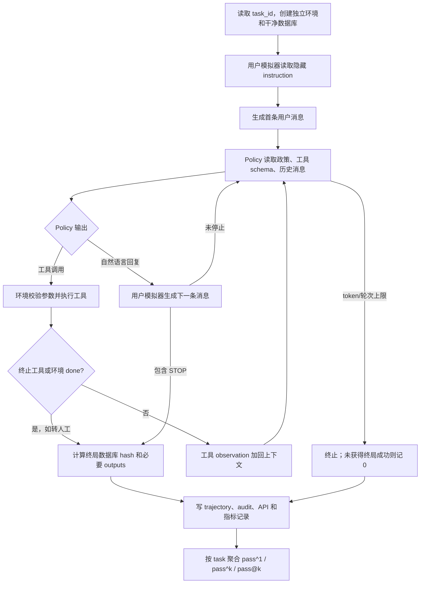

# τ-bench 数据、交互环境与本项目评测协议

> 文档状态：2026-09-23 核验版
> 适用范围：仓库内 vendored `tau-bench`、Qwen3 E00、E01、E05、E06、E07、E11、E12 实验使用的 airline 环境与当前评测脚本
> 核心结论：本项目沿用 τ-bench 的终局数据库状态与必要输出判定，并按任务宏平均报告 `pass^1`；但 40/10 数据划分、MiMo 用户模拟器和运行上限属于项目协议，不能把项目成绩直接当作官方 leaderboard 成绩。
> 配套阅读：[实验架构、算法组件与完整工作流](experiment_architecture_and_workflow.md)。

## 1. 基准解决什么问题

τ-bench 用可执行工具、可变数据库、业务规则和一个模拟用户，评估语言模型能否完成多轮客服任务。它不只考察模型是否能调用某个工具，还要求模型：

- 从逐步披露的用户信息中识别目标；
- 遵守 airline 或 retail 的业务政策；
- 先读取必要记录，再构造有依赖关系的写操作；
- 在需要确认时继续对话；
- 让会话结束后的数据库达到标注目标状态；
- 在任务要求报告金额、编号等信息时，把必要输出告诉用户；
- 在同一任务的多次随机运行中保持稳定。

原论文将这种设置称为 tool-agent-user interaction，并用 `pass^k` 衡量同一任务重复运行时的可靠性。论文、代码和官方结果的主要入口为：

- [τ-bench 论文（ICLR 2025）](https://openreview.net/forum?id=roNSXZpUDN)
- [论文 arXiv 页面](https://arxiv.org/abs/2406.12045)
- [官方 GitHub 仓库及运行说明](https://github.com/sierra-research/tau-bench)
- [官方终局评分实现](https://github.com/sierra-research/tau-bench/blob/main/tau_bench/envs/base.py)
- [官方重复试验指标实现](https://github.com/sierra-research/tau-bench/blob/main/tau_bench/run.py)
- [官方用户模拟器实现](https://github.com/sierra-research/tau-bench/blob/main/tau_bench/envs/user.py)

官方仓库目前明确提示，原始 airline/retail 任务已经过时，修订后的任务在后继 τ³-bench 中维护。因此，本项目结果应标成“原始 τ-bench vendored 快照上的项目协议结果”，不能与 τ³-bench 混称。

## 2. 数据集组成

### 2.1 两个业务域

原论文报告的公开测试规模如下。

| 项目 | τ-retail | τ-airline |
| --- | ---: | ---: |
| 公开评测任务 | 115 | 50 |
| 业务数据库 | 500 users、50 products、1,000 orders | 500 users、300 flights、2,000 reservations |
| 论文统计的业务 API | 7 write、8 non-write | 6 write、7 non-write |
| 当前 vendored 代码暴露的工具类 | 16 | 14 |

工具类数量比论文业务 API 数多一项，是因为当前代码的 `ALL_TOOLS` 还暴露了辅助 `think`；列表也包含 `transfer_to_human_agents`。实际清单见 [airline tools](../../tau-bench/tau_bench/envs/airline/tools/__init__.py) 和 [retail tools](../../tau-bench/tau_bench/envs/retail/tools/__init__.py)。

当前 vendored 任务文件的静态 AST 计数为：

| 业务域 | 文件/加载名 | 任务数 | 本项目是否使用 |
| --- | --- | ---: | --- |
| airline | `tasks_test.py` / `test` | 50 | 是，所有当前实验的母集合 |
| airline | `train`、`dev` | 不存在 | 否 |
| retail | `tasks_train.py` / `train` | 500 | 否 |
| retail | `tasks_dev.py` / `dev` | 20 | 否 |
| retail | `tasks_test.py` / `test` | 115 | 否 |

加载关系由 [airline 环境](../../tau-bench/tau_bench/envs/airline/env.py) 和 [retail 环境](../../tau-bench/tau_bench/envs/retail/env.py) 定义。尤其要注意：airline 的 `task_split: test` 指向完整 50 题原始集合；项目自己的 `train/test` 是在其上建立的索引划分。

### 2.2 一个任务包含什么

运行时 `Task` 的有效字段见 [types.py](../../tau-bench/tau_bench/types.py)：

| 字段 | 类型 | 作用 | 对 policy 是否可见 |
| --- | --- | --- | --- |
| `user_id` | string | 将任务关联到数据库中的用户 | 只有用户说出或工具返回后才可见 |
| `instruction` | string | 用户模拟器的隐藏人物设定和完整目标 | 不直接给 policy |
| `actions` | list of `Action` | 标注的目标动作，用于重放得到目标数据库状态 | 不给 policy |
| `outputs` | list of string | 成功时必须在回复中出现的文本 | 不给 policy |

任务源码里还可能带有 `annotator` 元数据，但当前 Pydantic `Task` 模型的评分接口不依赖它。

下面是一个经过改写和脱敏的结构示例，只展示字段关系，不对应任何真实题目的答案：

```yaml
user_id: example_user_0000
instruction: >-
  用户想把一段既有行程改到更晚的日期；用户不记得预订号，
  只会在客服询问时逐步提供身份信息，并要求改动前确认费用。
actions:
  - name: update_reservation_flights
    kwargs:
      reservation_id: EXAMPLE
      cabin: economy
      flights: [...]
      payment_id: example_payment
outputs:
  - "示例金额"
```

`actions` 不是要求 agent 原样复现的唯一工具序列。评分器把这些动作在一份干净数据库上重放，得到目标终态，然后比较 agent 会话结束时的数据库终态。因此 agent 可以使用额外的只读查询，也可以通过不同但等价的对话路径达到目标。

### 2.3 数据库、政策和工具

每个业务域由四部分共同定义：

1. 静态初始数据库，例如用户、预订、航班或订单；
2. 业务政策 `wiki/rules`，作为 agent 的系统上下文；
3. 带 JSON schema 的读写工具；
4. 任务中的隐藏用户目标与目标动作。

airline 当前暴露 14 个工具，包括预订、取消、更新航班/乘客/行李、查询用户/预订/航班、计算、发送凭证、思考和转人工。项目侧的 schema 副本见 [tau_bench_airline_tools.yaml](../configs/tool_config/tau_bench_airline_tools.yaml)，启动时会与实际加载的工具 schema 做一致性校验。

数据库不是跨 trajectory 持续变化的线上数据库。每条 trajectory 都从 `load_data()` 的同一初始快照建立独立环境，所以一次失败或成功不会改变下一次试验的起点。

## 3. 谁能看到什么

| 信息 | Policy agent | 用户模拟器 | 环境/评分器 |
| --- | --- | --- | --- |
| 业务政策全文 | 可见 | 不作为其系统提示输入 | 可见 |
| 工具名称与参数 schema | 可见 | 不可见 | 可见 |
| 隐藏 `instruction` | 不可见 | 可见 | 可见 |
| 目标 `actions` / `outputs` | 不可见 | 不可见 | 可见 |
| 当前对话历史 | 可见 | 只见用户模拟器自己的对话历史 | 可见 |
| 完整数据库 | 不可见 | 不可见 | 可见 |
| 工具返回的局部数据库记录 | 可见 | 只有 agent 转述后才知道 | 可见 |
| 最终成功分数 | 训练/汇总阶段使用 | 不可见 | 计算并返回 |

原始 LLM 用户模拟器把隐藏 `instruction` 放在自己的 system prompt 中，要求一次只说一行、逐步披露、不要编造未提供的信息，并在认为目标完成时输出 `###STOP###`。这套行为约束见 [vendored user.py](../../tau-bench/tau_bench/envs/user.py)。

这种可见性设计使 agent 不能直接读取标注答案；它必须通过用户对话和工具观察恢复完成任务所需的信息。不过所有原始任务及目标动作都是公开代码，因此这里的“未见任务”只表示训练流程没有采样这些 ID，并非带私有答案的隐藏测试集。

## 4. 一条 trajectory 的完整执行流程



本项目的具体生命周期由以下模块串联：

- [tau_bench_agent_loop.py](../src/envs/tau_bench_agent_loop.py)：把 policy、工具和 interaction 组织成状态机；
- [tau_bench_interaction.py](../src/envs/tau_bench_interaction.py)：创建环境、驱动用户模拟器、终止并取最终分数；
- [tau_bench_tools.py](../src/envs/tau_bench_tools.py)：把 veRL tool call 转换成 τ-bench `Action`；
- [tau_bench_context.py](../src/envs/tau_bench_context.py)：按异步 trajectory 隔离环境与计数器；
- [mimo_user_simulator.py](../src/envs/mimo_user_simulator.py)：为每条 trajectory 维护独立的 MiMo 对话历史。

### 4.1 环境隔离

每条 trajectory 开始时：

1. 生成唯一 `request_id`；
2. 用固定 `task_id` 新建一个 τ-bench env；
3. `env.reset(task_index=...)` 重载干净数据库并清空动作历史；
4. 为该 trajectory 新建 MiMo history；
5. 用 `contextvars` 把 env/state 绑定到当前异步任务；
6. trajectory 结束后从 `_instance_dict` 清理，并释放 context。

这避免并发 rollout 共享数据库或把一条对话的用户历史串到另一条对话。工具类本身无状态，实际状态由当前 context 中的 env 提供。

### 4.2 轮次和 token 上限

当前 Qwen3 共同配置见 [qwen3_common.yaml](../configs/train/grpo/qwen3_common.yaml)：

| 限制 | 当前值 | 含义 |
| --- | ---: | --- |
| `max_user_turns` | 15 | veRL 用户交互次数上限 |
| `max_assistant_turns` | 15 | policy 生成次数上限 |
| interaction `max_turns` | 30 | `用户回复次数 + 实际工具调用数` 上限 |
| `max_prompt_length` | 8,192 tokens | 初始 policy prompt 上限 |
| `max_response_length` | 12,288 tokens | 整条多轮轨迹中生成/观察后缀的预算 |
| `max_model_len` | 24,576 tokens | vLLM 最大上下文 |

因此“30 turns”不是简单的 15 轮问答：interaction 侧把每次用户模拟器回复和每次工具执行都计为一个事件；veRL 还分别限制最多 15 次 assistant 和 15 次 user 交互。响应 token 用尽、工具响应预算用尽或任一轮次上限到达也会结束 trajectory。

### 4.3 训练 token mask

初始 prompt 包含 airline policy、工具 schema 和首条用户消息，且全部不进入 actor loss。多轮执行时：

- policy 自己生成的 assistant token：`response_mask = 1`；
- 工具 observation：`response_mask = 0`；
- 后续用户模拟器消息：`response_mask = 0`；
- padding：`response_mask = 0`。

因此 GRPO、OPD 和 OPSD 更新的都是 policy 实际生成的 token，不会把用户模拟器或工具返回当成学生输出训练。veRL 的定义可见 [agent_loop.py](../../verl/verl/experimental/agent_loop/agent_loop.py) 和 [tool_agent_loop.py](../../verl/verl/experimental/agent_loop/tool_agent_loop.py)。

## 5. 成功如何判定

### 5.1 官方终局二元分数

原始评分器的步骤为：

1. 会话结束时，把 agent 已执行工具后的完整数据库转换成稳定、递归可排序结构并计算 SHA-256；
2. 重新加载一份初始数据库；
3. 在干净数据库上重放任务的标注 `actions`，得到目标数据库 hash；
4. 两个 hash 完全相同，数据库条件才通过；
5. 若任务含 `outputs`，每个必要字符串还必须出现在至少一次 `respond` 内容中；比较忽略大小写，并从回复内容中去掉逗号；
6. 数据库条件和必要输出条件都通过时 reward 为 `1.0`，否则为 `0.0`。

对应本地代码是 [base.py](../../tau-bench/tau_bench/envs/base.py)。这是一种“结果状态”评分：不会要求 agent 的工具调用序列与标注序列逐项相同。

### 5.2 这个判定能证明什么，不能证明什么

reward 为 1 可以证明：在该次独立环境中，最终数据库与标注动作产生的目标数据库一致，且所有必要输出字符串出现过。

它不能单独证明：

- 对话礼貌、自然或简洁；
- agent 的每个中间动作都必要；
- agent 完整遵守了所有无法从终态反映的政策；
- 回复中除必要字符串外的其他陈述都正确；
- agent 没有先做错误写操作再恢复到正确终态；
- 用户模拟器正确识别了所有业务完成条件。

所以“τ-bench 成功”应理解为可执行终态 oracle 通过，不应写成完整政策合规 oracle。必要输出采用子串匹配，也比语义正确性判断更窄。

### 5.3 本项目有没有修改成功条件

本项目 `binary` 模式仍以 vendored `Env.calculate_reward()` 的 `0/1` 结果作为 `outcome_reward`，没有把 MiMo 的主观判断或 PRM 分数当作评测成功。

项目协议另有三类外围约束：

- assistant 泄漏 `<tool_response>` 模板标记时，将 trajectory 标为污染并以 0 结束；
- 达到 token 或轮次上限且尚未获得终局 reward 时记 0；
- 用户模拟器的明确 API 基础设施故障会抛出并中止 batch，避免静默变成正常任务失败；工具参数错误则按官方风格返回 `Error: ...`，agent 可以继续修复。

这些约束不会把官方失败放宽成成功，但可能让某些本可继续执行的 trajectory 提前失败，因此属于项目运行协议的一部分。PRM-Lite 实验可在训练时使用额外 process reward；验证记录会强制回到二元 `outcome_reward`，不能拿训练 reward 代替 τ-bench 成功率。

## 6. 指标定义

设任务集合为 $T$。任务 $t$ 独立运行 $n_t$ 次，其中 $c_t$ 次 reward 为 1。

### 6.1 单次成功率与宏平均 `pass^1`

单任务成功率为：

$$
p_t = \frac{c_t}{n_t}.
$$

项目主表的单次成功率按任务宏平均：

$$
\operatorname{pass}^{1}
= \frac{1}{|T|}\sum_{t\in T}\frac{c_t}{n_t}.
$$

`pass@1` 与 `pass^1` 在数学上相同，都是一次随机完整运行成功的估计概率。宏平均意味着每个任务权重相同，而不是让轨迹更多的任务权重更大。当所有任务都有相同的 8 次采样时，宏平均也恰好等于总成功轨迹数除以总轨迹数。

例如 E01 step 200 的周期评测是 40 个项目 train 任务、每题 8 次，共 320 条，其中 284 条成功，所以：

$$
\operatorname{pass}^{1}=\frac{284}{320}=88.75\%.
$$

这个数是 train-task resampling 成绩，不是“40 题中有多少题至少成功一次”，也不是 held-out test 成绩。

### 6.2 可靠性 `pass^k`

τ-bench 的核心可靠性指标要求抽出的 $k$ 次运行全部成功。有限样本无放回估计为：

$$
\widehat{\operatorname{pass}^{k}}_t
= \frac{\binom{c_t}{k}}{\binom{n_t}{k}},
\qquad n_t \ge k.
$$

整体结果仍按任务宏平均：

$$
\widehat{\operatorname{pass}^{k}}
= \frac{1}{|T|}\sum_{t\in T}
\widehat{\operatorname{pass}^{k}}_t.
$$

它回答“随机挑出的 $k$ 次是否每次都成功”，$k$ 越大，对不稳定行为惩罚越强。当前项目汇总 JSON 中对应字段名为 `pass_all_4`；展示时应写作 `pass^4`。

### 6.3 能力上界 `pass@k`

`pass@k` 要求 $k$ 次中至少一次成功：

$$
\widehat{\operatorname{pass@}k}_t
=1-\frac{\binom{n_t-c_t}{k}}{\binom{n_t}{k}},
\qquad n_t \ge k.
$$

它适合允许重试并能识别成功结果的系统；它不是 τ-bench 强调的“一次都不能失败”的可靠性指标。当前项目汇总 JSON 的 `pass_at_4` 即 `pass@4`。

### 6.4 数值例子：$n=8,c=4$

某任务运行 8 次、成功 4 次时：

| 指标 | 数值 | 含义 |
| --- | ---: | --- |
| `pass^1 = pass@1` | $4/8=0.5$ | 单次成功概率 |
| `pass^4` | $\binom{4}{4}/\binom{8}{4}=1/70\approx0.0143$ | 任取 4 次全部成功 |
| `pass@4` | $1-\binom{4}{4}/\binom{8}{4}=69/70\approx0.9857$ | 任取 4 次至少一次成功 |
| `pass^8` | $0$ | 8 次不可能全部成功 |
| `pass@8` | $1$ | 8 次中确定至少有一次成功 |

这个例子说明 `pass@k` 和 `pass^k` 不能互换：前者看“有没有能力撞对”，后者看“能否稳定不出错”。实现见 [pass_metrics.py](../src/evaluation/pass_metrics.py)。

## 7. 本项目的数据划分

### 7.1 固定 40/10 划分

项目从 airline 的 50 个官方公开测试任务中建立固定划分，没有单独 dev 集：

| 项目划分 | 数量 | task IDs |
| --- | ---: | --- |
| train / `seen_task_ids` | 40 | 0, 1, 2, 4, 5, 6, 7, 8, 9, 11, 12, 13, 14, 15, 17, 18, 19, 21, 22, 24, 25, 27, 28, 29, 31, 32, 33, 34, 35, 37, 38, 39, 40, 41, 42, 44, 45, 47, 48, 49 |
| test / `unseen_task_ids` | 10 | 3, 10, 16, 20, 23, 26, 30, 36, 43, 46 |

权威划分文件为 [split.json](../experiments/sft_collect_airline/split.json)，SHA-256 为：

```text
33f3c6399c81ed641e096dae438939b7121bba953f0dae7a5b86c640f66c3fb9
```

准备脚本会断言两组无交集、合并后正好是 `0..49`，并把这个 hash 写入每次 `run.json`。见 [prepare_qwen3_run.py](../scripts/train/grpo/prepare_qwen3_run.py)。

### 7.2 三种“见过”不能混在一起

文档和分析中至少存在三层 exposure：

1. **SFT 数据采集尝试过**：旧的 72B 采集器对全部 50 题各尝试 16 次；这不等于学生模型训练过这些任务。
2. **有成功教师轨迹**：19 个 task 的采集元数据至少含一条成功轨迹。与当前 40 个 train ID 相交得到旧文档所称的 16 个 `covered_seen`；其余 24 个 train ID 称 `uncovered_seen`。
3. **实际进入 SFT [`train.jsonl`](../experiments/sft_collect_airline/train.jsonl)**：当前文件有 45 条轨迹，只覆盖 14 个不同 task：0, 13, 15, 17, 21, 24, 33, 34, 37, 38, 40, 42, 44, 47。

审计还发现：task 6 和 48 的采集元数据显示成功，但它们不在当前合并后的 [`train.jsonl`](../experiments/sft_collect_airline/train.jsonl) 中。因此，“16 个 covered_seen”是按采集成功元数据定义的历史分析标签；若要声称模型实际用哪些任务做过 SFT，应以训练输入 JSONL 的 14 个 ID 为准。

[`holdout_train.jsonl`](../experiments/sft_collect_airline/holdout_train.jsonl) 有 22 条轨迹，只覆盖项目 test 中的 16、30、43，当前应视为保留数据，不能用于训练后再称这些任务完全未见。文件证据如下：

| 文件 | 行数 | SHA-256 |
| --- | ---: | --- |
| [`train.jsonl`](../experiments/sft_collect_airline/train.jsonl) | 45 | `f39e237346f40f7ec6fd2cca0c73b0055b71182fd1b96841d00c1f7dfc8b58cb` |
| [`holdout_train.jsonl`](../experiments/sft_collect_airline/holdout_train.jsonl) | 22 | `a4ba4a352a7f4fbadeb7171bc5d913c66b0ebeb79c1ddfb886b7a2f75da83fae` |

当前 E01 没有加载这些历史 SFT 文件。E01 的 [run.json](../experiments/e01_vanilla_grpo/formal-seed42-200-v3/train/run.json) 记录 `adapter: null`，从官方 Qwen3-8B base model checkpoint 启动；旧的 `covered_seen` 分析主要属于此前 SFT/GRPO 线路。每个实验都应根据自己的 `run.json` 和实际 checkpoint lineage 判断 exposure。

### 7.3 正确使用 train 与 test

- train 40：用于 RL 采样、训练曲线和调试；其周期评测反映训练任务上的重采样性能。
- test 10：只用于冻结方案后的独立评测；不能据 test 结果反复调参数。
- 全 50：可以用于描述覆盖面，但其中 40 题已经被 RL 训练，不能命名为 held-out 泛化成绩。
- 旧文档的 `uncovered_seen + unseen` 自定义“泛化”指标混合了 24 个 RL train 任务和 10 个 test 任务，不等于纯 held-out test 指标。

## 8. 当前 Qwen3 训练与评测协议

### 8.1 训练 rollout

当前共同设置为：

| 项 | 值 |
| --- | --- |
| 每步任务数 | 4 |
| 每任务 rollout 数 | 8 |
| 每步 trajectory 数 | 32 |
| policy sampling | temperature 1.0, top-p 1.0, top-k -1 |
| 数据来源 | 40 个 train task |
| seed | 42 |
| outcome | τ-bench 二元终局分数 |

每组 8 条轨迹用于 GRPO 组内 advantage。训练过程中写出的总体 reward 或 6,400 条训练 rollout 成功率受到同任务重复更新影响，不应当作独立评测结果。

### 8.2 周期评测

E01 正式配置在 step 100 和 200 评测：

| 项 | 值 |
| --- | --- |
| 任务 | 40 个 train task |
| 每题样本 | 8 |
| 每次评测总轨迹 | 320 |
| policy sampling | temperature 0.7, top-p 0.9, top-k -1 |
| 参数更新 | 关闭；validation trajectory 不参与梯度 |
| reward | 强制使用二元 outcome |

所以 E01 step 200 的 88.75% 是“train 独立重采样 `pass^1`”，其中“独立”表示没有拿训练 rollout 直接充当评测，不表示任务与训练集独立。

E01 step 200 已按相同 simulator、采样参数和 turn/token 上限完成 held-out test：10 个 test task、每题 8 次，共 80 条 trajectory，成功 52 条。验收摘要为 `accepted: true`，结果是 `pass^1=65.00%`、`pass^4=60.00%`、`pass@4=75.71%`。原始依据见 [E01 test summary](../experiments/e01_vanilla_grpo/test-step200-seed42-v1/eval/summary.json)。它与 88.75% train 重采样结果的差距也说明两者必须分栏报告。

### 8.3 用户模拟器差异

官方仓库默认用 GPT-4o 作为 LLM 用户模拟器。本项目当前使用 MiMo `mimo-v2.5`：

| 项 | 当前项目值 |
| --- | --- |
| temperature | 0.7 |
| top-p | 0.8 |
| max completion tokens | 1,024 |
| thinking | disabled |
| 速率配置 | 100 RPM、10,000,000 TPM、最多 32 inflight |

配置见 [tau_bench_airline_mimo.yaml](../configs/interaction_config/tau_bench_airline_mimo.yaml) 和 [mimo_client.py](../src/envs/mimo_client.py)。MiMo 仍复用官方 `LLMUserSimulationEnv` 的 task-aware system prompt 与逐步披露规则，但模型、采样和 API 行为不同，足以改变对话路径与成功概率。

## 9. 评测产物和验收流程

一次可审计运行至少应保留：

| 产物 | 内容 |
| --- | --- |
| `run.json` | 模型、任务 ID、split hash、seed、样本数、step、checkpoint 来源 |
| `eval_trajectories.jsonl` | 每条轨迹的 task、score、终止原因、消息和 token/turn 统计 |
| `tool_audit.jsonl` | 生成的工具标签、JSON/schema 合法性和实际执行记录 |
| `api.jsonl` | 用户模拟器请求、重试、usage 和延迟，不含密钥 |
| `metrics.jsonl` | trainer/validation 指标 |
| `summary.json` | 聚合指标、完整性检查和错误列表 |
| `exit_code.txt` | 进程是否正常退出 |

汇总入口 [summarize_qwen3.py](../scripts/eval/summarize_qwen3.py) 会检查：

- 进程退出码为 0；
- trajectory ID 唯一且数量符合预算；
- task ID 与声明 split 一致；
- outcome 是有限二元值；
- 输入协议和 schema 校验通过；
- audit 覆盖所有轨迹；
- API 没有未处理的 terminal failure；
- 每题样本数准确；
- 训练和 validation 记录没有混用；
- checkpoint 必要文件完整。

指标聚合由 [run_metrics.py](../src/evaluation/run_metrics.py) 先按 task 分组，再对 task 指标做宏平均。缺少样本的任务不能默认为 0 后继续发布；这类运行应先判为不完整。

## 10. 与官方 τ-bench 和其他模型结果的可比性

### 10.1 一致的部分

- 使用原始 airline 数据库、政策、工具和 50 个任务；
- 核心成功判定来自最终数据库 hash 和必要输出；
- `pass^1` 与 `pass^k` 的按任务宏平均定义一致；
- 每条重复试验从干净环境开始。

### 10.2 不一致的部分

- 项目把公开 50 题切成 40 train / 10 test，官方 leaderboard 在完整公开测试集上评测；
- 项目用 MiMo，官方 README 默认 GPT-4o 用户模拟器；
- policy 模型、chat template、sampling 参数和最大交互长度不同；
- 项目有格式污染判零和 veRL token budget；
- 项目 vendored 快照未必等于官方仓库当前 commit，官方当前又建议迁移到 τ³-bench；
- train 周期评测已经对相同任务做过 RL 更新。

因此可以说“指标定义接近/沿用 τ-bench”，不能说“88.75% 超过官方某模型的 42%”而省略协议差异。前者是项目 train 重采样，后者是官方全测试集和官方 simulator 条件下的结果。

### 10.3 若要做可发表的横向比较

应固定并公开以下条件：

1. 精确 task 文件 hash 或 τ-bench commit；
2. 完整 50-task airline 测试集；
3. user simulator 模型、版本、system prompt、temperature 和 top-p；
4. policy sampling、tool format、token/turn 上限；
5. 每题独立运行次数 $n$ 和随机种子；
6. `pass^1`、至少一个 `pass^k`、成功数/总数；
7. 基础设施失败、重试和缺失轨迹处理规则；
8. 是否存在 SFT、RL、few-shot 或人工调参造成的任务暴露。

即使以上运行条件完全一致，E01/E05 已经在这 50 题中的 40 题上做过 RL；其“全 50 题”结果仍是 40 个训练曝光任务与 10 个 held-out 任务的混合，不能解释成独立泛化测试，也不能直接对齐官方零样本 leaderboard。要对齐官方零样本口径，应使用未在这 50 题上训练、选参或提供 few-shot 示例的模型；要评价已训练模型的泛化，则应使用真正独立的任务集合。

若无法复刻官方 simulator，最稳妥的比较方式是在同一项目协议下重新运行所有待比较模型，而不是把不同论文表格中的数字直接拼在一起。

## 11. 主要局限与解读边界

1. **test 只有 10 题。** 每题 8 次可以估计随机性，但任务覆盖仍很窄；小差异可能来自任务组成和 simulator 波动。
2. **任务和答案公开。** “unseen”是训练管线意义上的未采样，不是私有 benchmark test。
3. **用户模拟器是随机模型。** 它可能过早停止、误解完成状态或生成不理想回复，改变 agent 得分。
4. **终态 oracle 不覆盖全部政策。** 不影响数据库的中间违规可能漏检。
5. **必要输出是字符串匹配。** 它不能验证完整语义，也可能受格式影响。
6. **`pass^k` 需要足够样本。** 当 $n<k$ 时指标不可用；8 次样本的组合估计只能计算 $k \le 8$；可计算不表示估计精度充分。
7. **周期 train eval 乐观。** 它适合监控学习过程，不是泛化结论。
8. **重复查看 test 会产生适应性过拟合。** 即使没有用 test 做梯度，按其结果持续选超参也会消耗测试集。
9. **原始任务版本已被官方标为旧版。** 与新 τ³-bench 的任务修订结果不能直接合并。

## 12. 推荐的结果表述

项目内统一使用以下列：

| 实验 | checkpoint | split | tasks × trials | success / total | `pass^1` | `pass^4` | `pass@4` | simulator | protocol |
| --- | --- | --- | --- | --- | --- | --- | --- | --- | --- |
| 示例 | step N | train 或 test | 40×8 或 10×8 | c/n | 宏平均单次成功率 | 四次全成功可靠性 | 四次至少一次 | MiMo 版本 | split hash/配置版本 |

文字结论应明确写：

- “train 任务重采样 `pass^1`”，或“held-out test `pass^1`”；
- 任务数、每题次数及成功轨迹数；
- simulator 和协议是否与被比较结果相同；
- `pass^k` 是全成功可靠性，`pass@k` 是至少一次成功。

不要只写“成功率 88.75%”，也不要把 `pass@4` 标成 τ-bench 的 `pass^4`。

## 13. 复现实验检查清单

- [ ] 记录 policy base、adapter/checkpoint 和精确 step。
- [ ] 记录 task 文件版本与 `split.json` SHA-256。
- [ ] 确认 train/test ID 无交集，且没有临时 dev 子集。
- [ ] 冻结 user simulator 模型和采样参数。
- [ ] 冻结 policy sampling、chat template、工具 schema 和轮次/token 上限。
- [ ] 每条 trajectory 新建环境，禁止复用变更后的数据库。
- [ ] validation 只用二元 outcome，不混入 process reward。
- [ ] 检查每题恰好有声明的 $n$ 次独立运行。
- [ ] 报告宏平均 `pass^1`、`pass^k`，按需要补充 `pass@k`。
- [ ] 同时报告 `c/n`，避免只有百分比没有样本量。
- [ ] 区分 train resampling、held-out test 和完整 50-task 评测。
- [ ] 检查 API 失败、重试、污染轨迹和提前终止原因。
- [ ] 保留 `run.json`、原始 JSONL、summary 和 source manifest。
- [ ] test 结果只在方案冻结后用于最终判断。

## 14. 本地证据索引

- 数据 schema：[tau-bench types](../../tau-bench/tau_bench/types.py)
- 环境执行与评分：[tau-bench base env](../../tau-bench/tau_bench/envs/base.py)
- 官方 runner 与 `pass^k`：[tau-bench run.py](../../tau-bench/tau_bench/run.py)
- airline 50 个任务：[tasks_test.py](../../tau-bench/tau_bench/envs/airline/tasks_test.py)
- 项目固定划分：[split.json](../experiments/sft_collect_airline/split.json)
- 项目运行准备与元数据：[prepare_qwen3_run.py](../scripts/train/grpo/prepare_qwen3_run.py)
- 项目二元/过程奖励适配：[tau_bench_interaction.py](../src/envs/tau_bench_interaction.py)
- 项目工具适配：[tau_bench_tools.py](../src/envs/tau_bench_tools.py)
- 项目指标公式：[pass_metrics.py](../src/evaluation/pass_metrics.py)
- 项目汇总和验收：[summarize_qwen3.py](../scripts/eval/summarize_qwen3.py)
- E01 完成运行元数据：[E01 run.json](../experiments/e01_vanilla_grpo/formal-seed42-200-v3/train/run.json)
- E01 验收摘要：[E01 summary.json](../experiments/e01_vanilla_grpo/formal-seed42-200-v3/train/summary.json)
- E01 held-out test 验收摘要：[test summary.json](../experiments/e01_vanilla_grpo/test-step200-seed42-v1/eval/summary.json)
